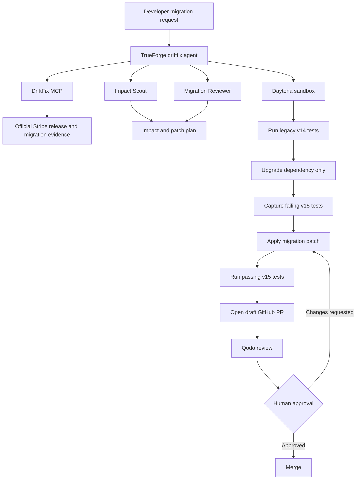

# DriftFix

DriftFix turns breaking Stripe Python SDK changes into reviewable migration pull requests. It finds official release and migration evidence, identifies affected code, verifies the failure and fix in a Daytona sandbox, and opens a draft GitHub pull request. A human remains responsible for merging.

The included demo intentionally starts on Stripe `14.3.0`. It reproduces the dictionary-method breakage introduced in Stripe v15, migrates the fixture to `15.6.0`, and returns all seven tests to green. The DriftFix MCP checks the latest stable Stripe release at runtime, so the agent can also analyze newer upgrades.

## What runs where

| Component | Purpose | Address |
| --- | --- | --- |
| React frontend | Demo dashboard, reports, analyzer, and trace views | `http://localhost:3000` |
| Codex provider | OpenAI-compatible adapter backed by your Codex login | `http://127.0.0.1:8765` |
| DriftFix MCP | Read-only Stripe release and migration evidence | `http://127.0.0.1:8000/mcp` |
| TrueForge | Agent orchestration, traces, subagents, and approvals | `http://localhost:8790` |
| Daytona | Isolated repository checkout and test execution | Managed by TrueForge |
| GitHub and Qodo | Draft PR creation and automated review | Remote services |

No OpenAI Platform API key is required. The model provider uses an authenticated Codex CLI session.

## Workflow



## Prerequisites

- Windows PowerShell and WSL 2
- Python 3.11 or newer
- Node.js 22.14 or newer
- Codex CLI authenticated with `codex login`
- A GitHub token that can create branches and pull requests in the target repository
- A Daytona API key
- Qodo installed on the GitHub repository if automated PR review is required

Do not commit real credentials. TrueForge owns GitHub and Daytona credentials; Codex runs from a temporary directory and does not receive them.

## Install

From the repository root in PowerShell:

```powershell
python -m venv .venv
.\.venv\Scripts\Activate.ps1
python -m pip install --upgrade pip
python -m pip install -e ".[dev]"

Set-Location frontend
npm ci
Set-Location ..

Copy-Item .env.example .env
```

Edit `.env` only for local backend settings such as `DRIFTFIX_GITHUB_REPOSITORY`. The provider loads `.env`; `scripts/configure_trueforge.py` intentionally reads credentials from the current shell instead.

## Run locally

Use separate terminals and keep every process running.

### 1. Start the Codex provider

```powershell
.\.venv\Scripts\Activate.ps1
$env:CODEX_PROVIDER_TIMEOUT_SECONDS = "600"
$env:DRIFTFIX_GITHUB_REPOSITORY = "ChiragSW/driftfix-4sum"
python -m driftfix.provider
```

Verify it at `http://127.0.0.1:8765/healthz`. The response should report `"status": "ok"` and `"authentication": "signed_in"`.

### 2. Start the DriftFix MCP server

```powershell
.\.venv\Scripts\Activate.ps1
python -m driftfix.server
```

The MCP endpoint is `http://127.0.0.1:8000/mcp`. Optional schema check:

```powershell
npx -y @modelcontextprotocol/inspector --cli http://127.0.0.1:8000/mcp --method tools/list --strict
```

### 3. Start TrueForge

TrueForge `0.1.4` failed its database migration when launched natively on the Windows test machine, so WSL is the verified setup.

In WSL, find the Windows host address and start TrueForge:

```bash
ip route show default
corepack pnpm@9.15.9 dlx @truefoundry/trueforge@latest --port 8790
```

Use the gateway address printed by the first command, for example `172.20.144.1`. In the two Windows service terminals, restart the provider and MCP bound to that address:

```powershell
$env:CODEX_PROVIDER_HOST = "<windows-host-ip>"
python -m driftfix.provider
```

```powershell
$env:DRIFTFIX_HOST = "<windows-host-ip>"
python -m driftfix.server
```

Run only one provider on port `8765` and one MCP server on port `8000`.

### 4. Configure the saved TrueForge agent

In a new PowerShell terminal:

```powershell
.\.venv\Scripts\Activate.ps1
$env:GITHUB_TOKEN = "<github-token>"
$env:DAYTONA_API_KEY = "<daytona-api-key>"
$env:CODEX_PROVIDER_BASE_URL = "http://<windows-host-ip>:8765/v1"
$env:DRIFTFIX_MCP_URL = "http://<windows-host-ip>:8000/mcp"
$env:TRUEFORGE_BASE_URL = "http://127.0.0.1:8790"
python scripts/configure_trueforge.py
```

The script creates or updates the Codex model, DriftFix MCP, pinned skill, Daytona provider, GitHub connector, and saved `driftfix` agent. In **Agents -> driftfix**, confirm that GitHub tools `create_branch`, `push_files`, and `create_pull_request` are enabled or preloaded, while `merge_pull_request` remains approval-gated.

### 5. Start the frontend

```powershell
Set-Location frontend
npm run dev
```

Open `http://localhost:3000`. Vite proxies provider calls to port `8765` and MCP calls to port `8000`.

## Run the agent

In TrueForge, open **Agents -> driftfix -> New session**. Do not use the default or inline playground agent because it does not include the DriftFix skill, MCP, or GitHub configuration.

Use this demo prompt:

```text
Analyze ChiragSW/driftfix-4sum on branch chirag. Upgrade the legacy Stripe v14
fixture to the latest stable release. Use the DriftFix MCP, Impact Scout,
Migration Reviewer, and Daytona. Show failing and passing tests. Open a draft
pull request. Do not merge without human approval.
```

The first tool event should normally appear within 30-90 seconds. A complete run usually takes about 4-10 minutes. Cancel and retry in a new `driftfix` session if the trace still contains only `turn.created` after two minutes.

Daytona is created by TrueForge when the agent needs it; you do not need to create a sandbox manually.

## Reproduce the fixture manually

```powershell
Set-Location demo_target
python -m venv .venv
.\.venv\Scripts\python.exe -m pip install -e ".[dev]"
.\.venv\Scripts\python.exe -m pytest -q
.\.venv\Scripts\python.exe -m pip install stripe==15.6.0
.\.venv\Scripts\python.exe -m pytest -q
```

The first run passes on v14. The dependency-only v15 upgrade then fails at `.get()`, `.keys()`, `.items()`, and `dict(stripe_object)`. A valid migration updates the dependency, converts Stripe objects with `to_dict()`, and makes all seven tests pass again. The fixture never calls Stripe's network API.

## Validate the project

```powershell
.\.venv\Scripts\python.exe -m pytest -q

Set-Location frontend
npm run build
```

## Qodo Reviewed PR

The latest merged pull request is [#6, Completion of frontend](https://github.com/ChiragSW/driftfix-4sum/pull/6), merged on August 30, 2026. Qodo reviewed the frontend and backend integration and reported these distinct findings:

- **High - [Scanner ignores the selected preset](https://github.com/ChiragSW/driftfix-4sum/pull/6#discussion_r3888565694):** choosing the invoice preset changes only part of the view while the displayed code, patch count, and diff remain tied to the customer preset.
- **High - [Sandbox verifies an invalid patch](https://github.com/ChiragSW/driftfix-4sum/pull/6#discussion_r3888565695):** the displayed Stripe patch is not executable, while the sandbox animation reports hard-coded passing results instead of running tests.
- **Medium - [Pull-request reports are not paginated](https://github.com/ChiragSW/driftfix-4sum/pull/6#discussion_r3888565697):** the provider reads only the first 100 GitHub pull requests and can silently omit older reports.
- **High - [Official-source failures are hidden](https://github.com/ChiragSW/driftfix-4sum/pull/6#discussion_r3888565699):** release lookup or validation failures are converted into an HTTP 200 response containing fallback migration guidance.
- **High - [Scanner results are simulated](https://github.com/ChiragSW/driftfix-4sum/pull/6#discussion_r3888565701):** scanner actions toggle local state and display fixed findings without calling repository analysis or a backend scanner.

These five Qodo threads were unresolved when the PR was merged. The separate Codex review is not included in this list.

## Verified hackathon evidence

- TrueForge session `01m14g71c8zg1fpz5fe84n2by2` found Stripe `15.6.0`, ran Impact Scout and Migration Reviewer, and recorded Daytona results of 7 passing v14 tests, 7 failures after the dependency-only v15 upgrade, and 7 passing migrated tests.
- TrueForge session `01m14gz3tg1kpbhapxpd2yxbaz` held the GitHub merge call for human approval before merging [PR #1](https://github.com/ChiragSW/driftfix-4sum/pull/1).
- [PR #6](https://github.com/ChiragSW/driftfix-4sum/pull/6) added the frontend and connected live pull-request reports to the backend.

## Safety

- DriftFix migration evidence tools are read-only.
- Codex runs without GitHub, Daytona, or OpenAI API credentials.
- Repository changes are made on a new branch and presented as a draft PR.
- Passing tests are required before requesting review.
- `merge_pull_request` requires explicit human approval.

AI-assistant disclosure: Codex supplied model reasoning through the local adapter and helped implement and test this repository. TrueForge remains responsible for MCP calls, subagents, Daytona execution, GitHub actions, session state, and the human merge checkpoint.
